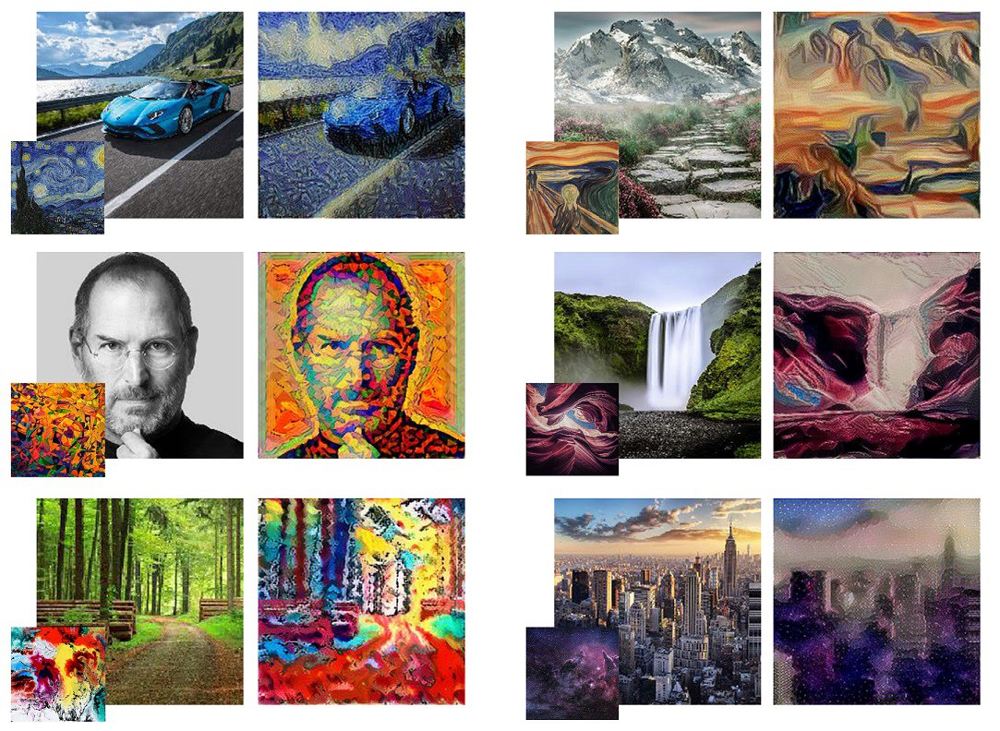

# <ins>Neural Style Transfer Artowrk</ins>

Neural style transfer is an optimization technique used to take three images, a content image, a style reference image (such as an artwork by a famous painter), and the input image you want to style — and blend them together such that the input image is transformed to look like the content image, but “painted” in the style of the style image.

The principle of neural style transfer is to define two distance functions, one that describes how different the content of two images are, Lcontent, and one that describes the difference between the two images in terms of their style, Lstyle. Then, given three images, a desired style image, a desired content image, and the input image (initialized with the content image), we try to transform the input image to minimize the content distance with the content image and its style distance with the style image.

In summary, we’ll take the base input image, a content image that we want to match, and the style image that we want to match. We’ll transform the base input image by minimizing the content and style distances (losses) with backpropagation, creating an image that matches the content of the content image and the style of the style image.

## Project Overview:

This project is based on Neural style transfer for creating artistic images from regular images.

For example:

### Goal of this project:

To create artistic looking images from regular images.

### Outcome:

Generated several artistic images with different styles incorporating on some images.

## Resources:

**Python version :** 3.7
**Packages Used:** pandas, numpy, PIL, time, matplotlib, seaborn, tensorflow

## Project Architecture:

- **Image Collection:** 

    - Web scrapper for image extraction from website.
    - Downloading specific styles 

- **Image Preprocessing:**

    - Dimension adjustment 
    - Resizing
    - VGG19 preprocessing

- **Model:**

    - Pre trained VGG19 model

- **Testing:**

    - Taking a random image and style and applyingstyle transfer algorithm

### 1. Image collection:

a) Built a web scrapper using basic python to download images from a website.

- Some sample images:

  

b) Selected specific styles and downloaded them manually.

- Some sample styles:

  

### 2. Image Preprocessing:

a) Loaded the images and styles from file path, re-defined the dimensons that is generally used in VGG19 model.

b) Resized the images in the desired format.

c) used inbuilt function of VGG model to preprocess the image the way the model expects.

### 3. Model:

a) Used a pre-trained VGG19 model that was originally created to classify 1000 images.

- Model architecture:

b) Extracted the layers for content and style seperately from all the available layers.

    content_layers = ['block5_conv2'] 

    style_layers = ['block1_conv1',
                    'block2_conv1',
                    'block3_conv1', 
                    'block4_conv1', 
                    'block5_conv1']

c) Created a model that will take in the input of vgg19 model and the content and style outputs genereated using the above layers and create a new model with these values.

d) Calculated the gram matrix for style claculation . Then computed the content loss and style loss seperately and sum them up for calculating the total loss.

- Gram Matrix and style loss formula:

e) Then applied the gradients to the image to update it with the style representations.

f) Finally updated the original image with the style features iteratively to create beatiful artistic looking images.

**This is the total workflow of the whole model building and training process.**

### 4. Testing.

With the above model, the following representations were made.

  

  

## Conclusion:

While conceptually simple, getting high quality results requires a lot of care. 

Neural style transfer allows to blend two images (one containing content and one containing style) together to create new art. With very little effort, we were able to “invert” a model originally trained to discriminate between cats and dogs, and use it to generate countless images in a myriad different styles. Try doing that with a random forest.
